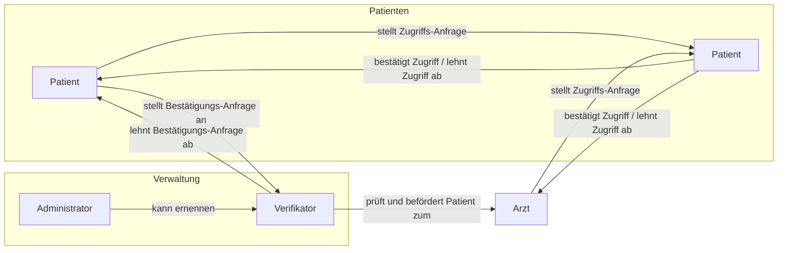

[](https://github.com/arne-kapell/patient-data-management/actions/workflows/deploy.yml)
[](https://github.com/arne-kapell/patient-data-management/actions/workflows/gitleaks.yml)
[](https://github.com/arne-kapell/patient-data-management/actions/workflows/codeql.yml)
# Patient Data Management System
Webanwendung zur Verwaltung von persönlichen, medizinischen Daten.

Features:
- Dokumentenverwaltung (Upload, Download, Löschen) inkl. In-Browser-Vorschau
- Zugriffs-Freigabe für Angehörige und Ärzte

## Deployment
---
Die Anwendung ist vollständig containerisiert und kann mit Docker und Docker Compose einfach aufgesetzt werden. Die benötigten Docker-Images werden automatisch von Docker Hub geladen bzw. gebaut.

### Testumgebung
```bash
docker-compose up
```
Die folgenden Services stehen zur Verfügung:
| Service                 | Port |
| ----------------------- | ---- |
| Django (Server + UI)    | 8000 |
| PostgreSQL              | -    |
| adminer (DB-Management) | 8080 |

*Hinweis:* Mails (z.B. für die E-Mail-Verifizierung) werden nicht versendet, sondern in der Konsole (des Django-Servers) ausgegeben.

### Produktivumgebung
```bash
docker-compose -f docker-compose.prod.yml up -d
```
Zusätzlich wird eine lokale traefik-Instanz (als sog. "Reverse Proxy") benötigt, die erforderlichen `labels` für das VPS-Deployment ([cloud.arne-kapell.de](https://cloud.arne-kapell.de)) sind bereits in der `docker-compose.prod.yml` hinterlegt.

*adminer* als leichtgewichtiges DB-Management-Tool wird in der Produktivumgebung nicht gestartet, dafür jedoch ein Backup-Service, der die PostgreSQL-Datenbank automatisch in regelmäßigen Abständen sichert.

## Architektur und Bedrohungsanalyse
---


## Präsentationen
---
0. [Anforderungen bzw. Aufgabenstellung](slides/Laborarbeit2022AufgabeSichereSysteme.pdf)
1. [Sicherheitsanforderungen & Bedrohungsanalyse](slides/abgabe01.html)
2. [Abschlusspräsentation](slides/abschlusspraesi.html)


## Testplan
---
### Funktionale Tests:
---
| TestID | Typ       | Beschreibung                                                       |
| -----: | --------- | ------------------------------------------------------------------ |
|    FT1 | Unit-Test | Benutzer-Erstellung und -Entfernung inklusive Rollen               |
|    FT2 | Unit-Test | Intigrität des Rollensystems                                       |
|    FT3 | Unit-Test | Login, Logout                                                      |
|    FT4 | Unit-Test | Email-Verifikation                                                 |
|    FT5 | Unit-Test | Erstellen und Entfernen von Zugriffsanfragen (Dokumenten-Freigabe) |
|    FT6 | Unit-Test | Upload, Vorschau und entfernen von Dokumenten                      |


### Security Tests:
---
| TestID | Typ                        | Beschreibung                                                                                                                                               | Schritte                                                                                                                       | Erwartetes Ergebnis                                                                    |       Status       |
| -----: | -------------------------- | ---------------------------------------------------------------------------------------------------------------------------------------------------------- | ------------------------------------------------------------------------------------------------------------------------------ | -------------------------------------------------------------------------------------- | :----------------: |
|     T1 | Unit-Tests                 | Gesundheits- bzw. persönliche Daten dürfen nur nach erfolgreicher Authentifizierung und nach autorisierung (mit den erforderlichen Rechten) abrufbar sein. | Versuchen, Daten ohne vorherigen Login bzw. mit unautorisiertem Benutzer abzurufen                                             | Blockieren mit Fehlermeldung ohne Daten-Leck                                           | :heavy_check_mark: |
|     T2 | Unit-Tests                 | Persönliche Daten dürfen nur für den jeweiligen Nutzer einsichtbar sein.                                                                                   | Versuchen auf die persönlichen Daten eines anderen Benutzers zuzugreifen                                                       | Blockieren mit Fehlermeldung ohne Daten-Leck                                           | :heavy_check_mark: |
|     T3 | Unit-Test / Manueller Test | Dokumente können nicht von Benutzern ohne erteilte Freigabe eingesehen werden                                                                              | Versuchen durch Umgehung der Freigabe-Bestimmung an Dokumente zu gelangen                                                      | Blockieren mit Fehlermeldung                                                           | :heavy_check_mark: |
|     T4 | Transaktion-Test           | Daten können nicht durch Überwachung des Kommunikations-Kanals exfiltriert werden                                                                          | Abfangen der Datenübertragung mittels Netzwerkmonitoring Tools                                                                 | Alle abgefangenen Dateien/Informationen befinden sich in einem verschlüsselten Zustand | :heavy_check_mark: |
|     T5 | Unit-Test und Pentests     | Zugriff auf Daten in der Datenbank durch SQL Abgfragen erlangen                                                                                            | Zugriff auf Datenbank mitells SQL Injection                                                                                    | Abblocken des Angriffs durch Eingabevalidierung                                        | :heavy_check_mark: |
|     T6 | Manueller-Test             | Zugriff auf Daten in der Datenbank nur mit Autorisierung                                                                                                   | Verbindungsaufbau zur Datenbank ohne gültigen Benutzer bzw. Benutzer mit nötigen Berechtigungen und Versuch Zugang zu erlangen | Verhindern durch Berechtigungsprüfung                                                  | :heavy_check_mark: |
|     T7 | Unit-Tests/Manuelle Tests  | Zugriff durch Ausnutzung typischer Web-Schwachstellen wie CSRF oder XSS nicht möglich                                                                      | Test-Eingaben, etc.                                                                                                            | Restriktives Verhalten der Anwendung ohne Daten preiszugeben                           | :heavy_check_mark: |
|     T8 | Unit-Test  /DDOS           | Datenbank ist vor Ausfall geschützt                                                                                                                        | Durch erhöhte Anzahl an Anfragen Verbindung zur Datenbank kompromittieren                                                      | Ausfallzeit so gering wie möglich (optional auch restriktives Verhalten)               | :heavy_check_mark: |
|     T9 | Unit-Test                  | Administrator Oberfläche nur für Administratoren sichtbar                                                                                                  | Versuchen an Informationen zu gelangen, die nur für Administratoren gedacht sind                                               | Fehlermeldung wegen fehlenden Berechtigungen für den Zugriff                           | :heavy_check_mark: |
|    T10 | Unit-Test                  | Anwendung ist vor Infizierungen durch Dateien geschützt                                                                                                    | Infizierte Datei unter Dokumenten hochladen                                                                                    | Filtern der Datei durch Clam AV                                                        |        :x:         |

## Sicherheits-Features
---
- [x] Login-System
  - [x] Session-Timeout (`30` Minuten und beim Schließen des Browsers)
  - [x] Passwort-Hashing (`PBKDF2`)
- [x] Dokument-Verschlüsselung beim Upload (`AES` mit `32` Byte langem Schlüssel)
  - [ ] Zusammengesetzte Schlüssel (50% Server-Schlüssel, 50% Benutzer-Schlüssel): Nicht implementiert, da kein ersichtlicher Mehrwert (ohne zusätzliche Anpassungen)
- [ ] Viren-Scan beim Upload (`ClamAV`): Standard-Bibliotheken veraltet, daher nicht implementiert
- [x] Regelmäßige Backups der Datenbank (`PostgreSQL`): 2x täglich (Retention-Werte siehe [docker-compose.prod.yml](docker-compose.prod.yml) `services.db_backup`)
- [x] CSRF- (und XSS-)Schutz durch Django-Standard (``): [Dokumentation](https://docs.djangoproject.com/en/4.1/ref/csrf/)
- [x] Beschränkung der Dokumenten-Dateitypen (PDF, Text-Dokumente und Bilder) und Dateigröße (max. `10` MB; siehe Whitelist unter `ACCEPTED_DOCUMENT_EXTENSIONS` bzw. `MAX_UPLOAD_SIZE` in [settings.py](patient_data_management/settings))

## Rollen- und Rechte-Management
---
|                                                   |      Patient       |        Arzt        |    Verifikator     |  (Administrator)   |
| ------------------------------------------------- | :----------------: | :----------------: | :----------------: | :----------------: |
| Eigene Dokumente verwalten (CRUD)                 | :heavy_check_mark: | :heavy_check_mark: | :heavy_check_mark: |                    |
| Zugriff auf fremde Dokumente anfragen             | :heavy_check_mark: | :heavy_check_mark: | :heavy_check_mark: |                    |
| Freigegebene Dokumente einsehen und herunterladen | :heavy_check_mark: | :heavy_check_mark: | :heavy_check_mark: |                    |
| Freigegebene Dokumente aktualisieren              |        :x:         | :heavy_check_mark: | :heavy_check_mark: |                    |
| Freigegebene Dokumente löschen                    |        :x:         |        :x:         |        :x:         |                    |
| Freischaltung als Arzt beantragen                 | :heavy_check_mark: |        :x:         |        :x:         |                    |
| Arztstatus bestätigen                             |        :x:         |        :x:         | :heavy_check_mark: |                    |
| Benutzer zum Verifikator ernennen                 |        :x:         |        :x:         |        :x:         | :heavy_check_mark: |
| Benutzer verwalten (CRUD)                         |        :x:         |        :x:         |        :x:         | :heavy_check_mark: |

### Privilege-Flow


## CI/CD(GitHub Actions)
---
- [CodeQL](.github/workflows/codeql.yml) (Static Code Analysis)
- [GitLeaks](.github/workflows/gitleaks.yml) (Secrets Detection)
  
  Scannt den gesamten Repository-Verlauf auf potentielle Secrets (z.B. API-Keys, Passwörter, etc.)

- [Deploy](.github/workflows/deploy.yml) (Deployment auf VPS)
  - SonarQube Scan (Code Quality)
  - Django-Tests (v.a. Unit-Tests)

Der aktuelle Stand der einzelnen Pipelines ist in den Badges am Anfang dieser *README* zu sehen.

## Persistierung der Daten
---
Daten werden in der containerisierten Anwendung in Docker-Volumes gespeichert. Diese sind Host-spezifisch und halten u.a. die (verschlüsselten) Dokumente und die Rohdaten der Datenbank. Die Datenbank wird regelmäßig gesichert und auf dem Host gespeichert.

