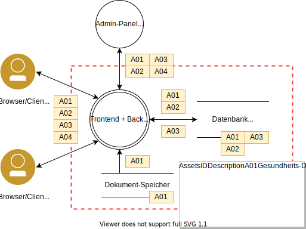
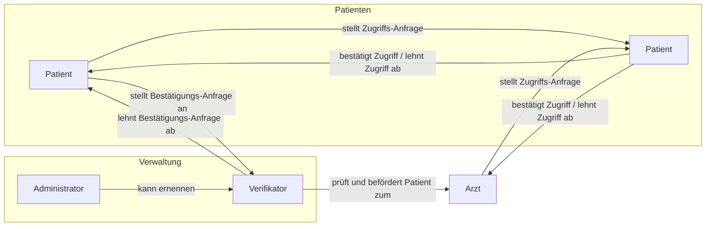
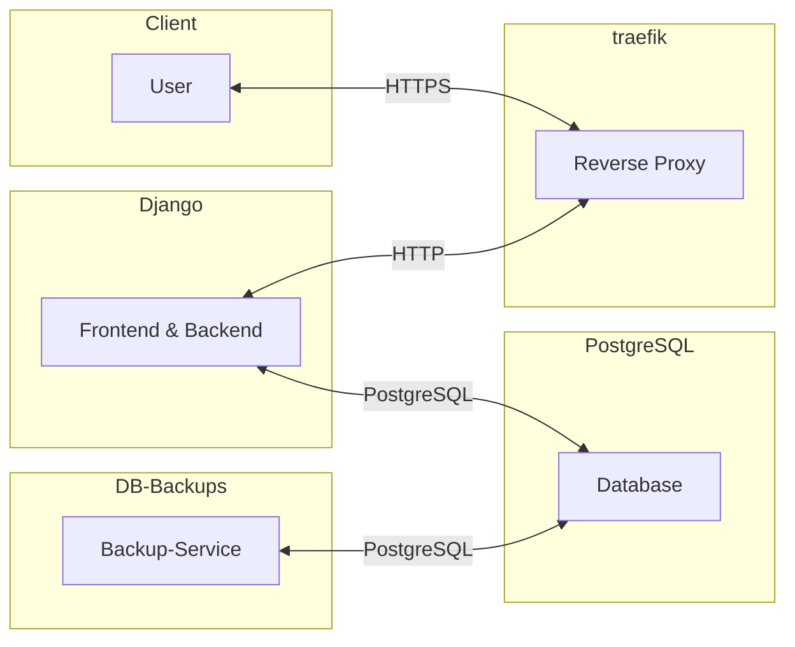

[](https://github.com/arne-kapell/patient-data-management/actions/workflows/deploy.yml)
[](https://github.com/arne-kapell/patient-data-management/actions/workflows/gitleaks.yml)
[](https://github.com/arne-kapell/patient-data-management/actions/workflows/codeql.yml)
# Patient Data Management System
Webanwendung zur Verwaltung von persönlichen, medizinischen Daten.

Features:
- Dokumentenverwaltung (Upload, Download, Löschen) inkl. In-Browser-Vorschau
- Zugriffs-Freigabe für Angehörige und Ärzte
---
Sicherheits-Fokus:
- Dokumenten-Zugriff-Anfragen zeitlich begrenzt (max. 1 Jahr)
- Zugriffs-Anfragen können abgelehnt und vom Steller zurückgezogen werden
- Dokumente können nur vom Eigentümer und einem Arzt überschrieben werden
- Löschen eines Benutzers löscht auch alle Dokumente und Zugriffs-Anfragen (Cascade)
- Datenbank-Backup (automatisch)
## Dokumente & Präsentationen
---
- Anforderungen bzw. Aufgabenstellung: [PDF](slides/Laborarbeit2022AufgabeSichereSysteme.pdf)
- Sicherheitsanforderungen & Bedrohungsanalyse: [HTML](slides/abgabe01.html) | [PDF](slides/abgabe01.pdf)
- Risiko-Register: [DOCX](slides/RisikoRegisterAbgabe.docx)
- Abschlusspräsentation: [HTML](slides/abschlusspraesi.html) | [PDF](slides/abschlusspraesi.pdf)
- Diese Dokumentation: [MD](README.md) | [PDF](README.pdf)

## Deployment
---
Die Anwendung ist vollständig containerisiert und kann mit Docker und Docker Compose einfach aufgesetzt werden. Die benötigten Docker-Images werden automatisch von Docker Hub geladen bzw. gebaut.

### Testumgebung
```bash
docker-compose up
```
Die folgenden Services stehen zur Verfügung:
| Service                 | Port |
| ----------------------- | ---- |
| Django (Server + UI)    | 8000 |
| PostgreSQL              | -    |
| adminer (DB-Management) | 8080 |

*Hinweis:* Mails (z.B. für die E-Mail-Verifizierung) werden nicht versendet, sondern in der Konsole (des Django-Servers) ausgegeben.

### Produktivumgebung
```bash
docker-compose -f docker-compose.prod.yml up -d
```
Zusätzlich wird eine lokale traefik-Instanz (als sog. "Reverse Proxy") benötigt, die erforderlichen `labels` für das VPS-Deployment ([cloud.arne-kapell.de](https://cloud.arne-kapell.de)) sind bereits in der `docker-compose.prod.yml` hinterlegt.

*adminer* als leichtgewichtiges DB-Management-Tool wird in der Produktivumgebung nicht gestartet, dafür jedoch ein Backup-Service, der die PostgreSQL-Datenbank automatisch in regelmäßigen Abständen sichert.

### Anlegen eines Admin-Benutzers
Vorausgesetzt man hat die Anwendung mit `docker-compose` gestartet, lässt sich ein Admin-Benutzer mit folgendem Befehl anlegen:
```bash
docker-compose exec django python manage.py createsuperuser
```
*Erklärung:* `docker-compose exec` führt den Befehl `python manage.py createsuperuser` in dem Container `django` aus. Der Container `django` ist der Django-Server, der die Anwendung bereitstellt. Der Befehl `createsuperuser` erstellt einen neuen Benutzer mit Admin-Rechten.

## Architektur und Bedrohungsanalyse
---

### Schutzziele
| Asset                      | Vertraulichkeit | Integrität | Verfügbarkeit |
| :------------------------- | :-------------: | :--------: | :-----------: |
| **A01**: Gesundheits-Daten |      X(1)       |    X(1)    |     X(2)      |
| **A02**: Persönl. Daten    |      X(1)       |    X(2)    |     X(3)      |
| **A03**: Anmelde-Daten     |      X(1)       |    X(2)    |     X(3)      |
| **A04**: Session-Daten     |      X(1)       |    X(3)    |     X(2)      |
| **A05**: Log-Daten         |      X(2)       |    X(1)    |     X(3)      |

### Risiko-Register
siehe [Risiko-Register](slides/RisikoRegisterAbgabe.docx)
## Architektur-Entscheidungen
---
### Django
Django ist ein Python-Framework, welches sich für die Entwicklung von Webanwendungen eignet. Es bietet eine Vielzahl an Features, die für die Entwicklung einer solchen Anwendung notwendig sind. Dazu gehören unter anderem:
- Benutzerverwaltung
- Berechtigungsverwaltung
- Datenbankanbindung
- Formulare
- Templates

Auch Sicherheitstechnisch bietet Django eine Vielzahl an Features, die für die Entwicklung einer solchen Anwendung notwendig sind. Dazu gehören unter anderem:
- CSRF-Schutz
- SQL-Injection-Schutz
- XSS-Schutz
- Session-Managment
- Passwort-Hashing

Folgende Django-Erweitungen wurden verwendet:
- whitenoise: Statische Dateien (CSS, JS, Bilder) werden vom Django-Server ausgeliefert und müssen nicht auf einem separaten Webserver (z.B. nginx) gehostet werden.
- django_encrypted_files: Dateien werden beim Upload verschlüsselt und beim Download entschlüsselt. Als Algorithmus wird AES verwendet.

### PostgreSQL
PostgreSQL ist eine relationale Datenbank, die für die Speicherung von Daten verwendet wird. Neben großer Verbreitung und Stabilität erfüllt sie auch alle Anforderungen, die für die Entwicklung einer solchen Anwendung notwendig sind.
Vorteile gegenüber anderen Lösungen:
- Open Source
- Skalierbarkeit
- Wiederherstellungsmechanismen

Zusätzlich bietet Django einige Datentypen, die nur in Kombination mit PostgreSQL verwendet werden können. (u.a. `ArrayField` und verschiedene Range-Datentypen)

### Traefik
Traefik ist ein Reverse Proxy, der für die Bereitstellung von Webanwendungen verwendet wird. Er bietet eine Vielzahl an Features, u.a. automatischer Bezug von SSL-Zertifikaten und automatische Weiterleitung von HTTP auf HTTPS.

## Testplan
---
### Funktionale Tests:
| TestID | Typ       | Beschreibung                                                       |
| -----: | --------- | ------------------------------------------------------------------ |
|    FT1 | Unit-Test | Benutzer-Erstellung und -Entfernung inklusive Rollen               |
|    FT2 | Unit-Test | Intigrität des Rollensystems                                       |
|    FT3 | Unit-Test | Login, Logout                                                      |
|    FT4 | Unit-Test | Email-Verifikation                                                 |
|    FT5 | Unit-Test | Erstellen und Entfernen von Zugriffsanfragen (Dokumenten-Freigabe) |
|    FT6 | Unit-Test | Upload, Vorschau und entfernen von Dokumenten                      |


### Security Tests:
| TestID | Typ                        | Beschreibung                                                                                                                                               | Schritte                                                                                                                       | Erwartetes Ergebnis                                                                    |       Status       |
| -----: | -------------------------- | ---------------------------------------------------------------------------------------------------------------------------------------------------------- | ------------------------------------------------------------------------------------------------------------------------------ | -------------------------------------------------------------------------------------- | :----------------: |
|     T1 | Unit-Tests                 | Gesundheits- bzw. persönliche Daten dürfen nur nach erfolgreicher Authentifizierung und nach autorisierung (mit den erforderlichen Rechten) abrufbar sein. | Versuchen, Daten ohne vorherigen Login bzw. mit unautorisiertem Benutzer abzurufen                                             | Blockieren mit Fehlermeldung ohne Daten-Leck                                           | :heavy_check_mark: |
|     T2 | Unit-Tests                 | Persönliche Daten dürfen nur für den jeweiligen Nutzer einsichtbar sein.                                                                                   | Versuchen auf die persönlichen Daten eines anderen Benutzers zuzugreifen                                                       | Blockieren mit Fehlermeldung ohne Daten-Leck                                           | :heavy_check_mark: |
|     T3 | Unit-Test / Manueller Test | Dokumente können nicht von Benutzern ohne erteilte Freigabe eingesehen werden                                                                              | Versuchen durch Umgehung der Freigabe-Bestimmung an Dokumente zu gelangen                                                      | Blockieren mit Fehlermeldung                                                           | :heavy_check_mark: |
|     T4 | Transaktion-Test           | Daten können nicht durch Überwachung des Kommunikations-Kanals exfiltriert werden                                                                          | Abfangen der Datenübertragung mittels Netzwerkmonitoring Tools                                                                 | Alle abgefangenen Dateien/Informationen befinden sich in einem verschlüsselten Zustand | :heavy_check_mark: |
|     T5 | Unit-Test und Pentests     | Zugriff auf Daten in der Datenbank durch SQL Abgfragen erlangen                                                                                            | Zugriff auf Datenbank mitells SQL Injection                                                                                    | Abblocken des Angriffs durch Eingabevalidierung                                        | :heavy_check_mark: |
|     T6 | Manueller-Test             | Zugriff auf Daten in der Datenbank nur mit Autorisierung                                                                                                   | Verbindungsaufbau zur Datenbank ohne gültigen Benutzer bzw. Benutzer mit nötigen Berechtigungen und Versuch Zugang zu erlangen | Verhindern durch Berechtigungsprüfung                                                  | :heavy_check_mark: |
|     T7 | Unit-Tests/Manuelle Tests  | Zugriff durch Ausnutzung typischer Web-Schwachstellen wie CSRF oder XSS nicht möglich                                                                      | Test-Eingaben, etc.                                                                                                            | Restriktives Verhalten der Anwendung ohne Daten preiszugeben                           | :heavy_check_mark: |
|     T8 | Unit-Test  /DDOS           | Datenbank ist vor Ausfall geschützt                                                                                                                        | Durch erhöhte Anzahl an Anfragen Verbindung zur Datenbank kompromittieren                                                      | Ausfallzeit so gering wie möglich (optional auch restriktives Verhalten)               | :heavy_check_mark: |
|     T9 | Unit-Test                  | Administrator Oberfläche nur für Administratoren sichtbar                                                                                                  | Versuchen an Informationen zu gelangen, die nur für Administratoren gedacht sind                                               | Fehlermeldung wegen fehlenden Berechtigungen für den Zugriff                           | :heavy_check_mark: |
|    T10 | Unit-Test                  | Anwendung ist vor Infizierungen durch Dateien geschützt                                                                                                    | Infizierte Datei unter Dokumenten hochladen                                                                                    | Filtern der Datei durch Clam AV                                                        |        :x:         |

## Sicherheits-Features
---
- [x] Login-System
  - [x] Session-Timeout (`30` Minuten und beim Schließen des Browsers)
  - [x] Passwort-Hashing (`PBKDF2`)
- [x] Dokument-Verschlüsselung beim Upload (`AES` mit `32` Byte langem Schlüssel)
  - [ ] Zusammengesetzte Schlüssel (50% Server-Schlüssel, 50% Benutzer-Schlüssel): Nicht implementiert, da kein ersichtlicher Mehrwert (ohne zusätzliche Anpassungen)
- [ ] Viren-Scan beim Upload (`ClamAV`): Standard-Bibliotheken veraltet, daher nicht implementiert
- [x] Regelmäßige Backups der Datenbank (`PostgreSQL`): 2x täglich (Retention-Werte siehe [docker-compose.prod.yml](docker-compose.prod.yml) `services.db_backup`)
- [x] CSRF- (und XSS-)Schutz durch Django-Standard (``): [Dokumentation](https://docs.djangoproject.com/en/4.1/ref/csrf/)
- [x] Beschränkung der Dokumenten-Dateitypen (PDF, Text-Dokumente und Bilder) und Dateigröße (max. `10` MB; siehe Whitelist unter `ACCEPTED_DOCUMENT_EXTENSIONS` bzw. `MAX_UPLOAD_SIZE` in [settings.py](patient_data_management/settings))

## Rollen- und Rechte-Management
---
|                                                   |      Patient       |        Arzt        |    Verifikator     |  (Administrator)   |
| ------------------------------------------------- | :----------------: | :----------------: | :----------------: | :----------------: |
| Eigene Dokumente verwalten (CRUD)                 | :heavy_check_mark: | :heavy_check_mark: | :heavy_check_mark: |                    |
| Zugriff auf fremde Dokumente anfragen             | :heavy_check_mark: | :heavy_check_mark: | :heavy_check_mark: |                    |
| Freigegebene Dokumente einsehen und herunterladen | :heavy_check_mark: | :heavy_check_mark: | :heavy_check_mark: |                    |
| Freigegebene Dokumente aktualisieren              |        :x:         | :heavy_check_mark: | :heavy_check_mark: |                    |
| Freigegebene Dokumente löschen                    |        :x:         |        :x:         |        :x:         |                    |
| Freischaltung als Arzt beantragen                 | :heavy_check_mark: |        :x:         |        :x:         |                    |
| Arztstatus bestätigen                             |        :x:         |        :x:         | :heavy_check_mark: |                    |
| Benutzer zum Verifikator ernennen                 |        :x:         |        :x:         |        :x:         | :heavy_check_mark: |
| Benutzer verwalten (CRUD)                         |        :x:         |        :x:         |        :x:         | :heavy_check_mark: |

### Privilege-Flow


## CI/CD(GitHub Actions) 
---
- [CodeQL](.github/workflows/codeql.yml) (Static Code Analysis)
- [GitLeaks](.github/workflows/gitleaks.yml) (Secrets Detection)
  
  Scannt den gesamten Repository-Verlauf auf potentielle Secrets (z.B. API-Keys, Passwörter, etc.)

- [Deploy](.github/workflows/deploy.yml) (Deployment auf VPS)
  - SonarQube Scan (Code Quality)
  - Django-Tests (v.a. Unit-Tests)

Der aktuelle Stand der einzelnen Pipelines ist in den Badges am Anfang dieser *README* zu sehen.

## Persistierung der Daten
---
Daten werden in der containerisierten Anwendung in Docker-Volumes gespeichert. Diese sind Host-spezifisch und halten u.a. die (verschlüsselten) Dokumente und die Rohdaten der Datenbank. Die Datenbank wird regelmäßig gesichert und auf dem Host gespeichert.

## Modulstruktur
---
<!-- mermaid diagram for the modules Django (with frontend), PostgreSQL, traefik -->


## Entwicklungs-Wekzeuge
---
### Git(Hub)
Git wurde als Versionskontrollsystem verwendet. Die Entwicklung fand auf einem privaten GitHub-Repository statt.
Weiterhin wurde GitHub als Plattform für die CI/CD-Pipelines verwendet (GitHub Actions) und auch für Dokumentations-Zwecke.
### Visual Studio Code
Als leichtgewichtige IDE wurde Visual Studio Code verwendet. Dieses ist mit den folgenden Erweiterungen ausgestattet:
- autopep8 (Python Formatter)
- Django (Django-Syntax-Highlighting)
- Actions (GitHub Actions)
### Docker/Podman (Compose)
Als Containerisierungslösung wurde Docker verwendet. Dabei wurden die beiden Umgebungen (Entwicklung und Produktiv) durch separate Docker-Compose-Dateien abgebildet. Auf dem Produktiv-Server wird Docker als Container-Engine verwendet. Diese lässt sich mittlerweile jedoch auch durch Podman ersetzen. Podman ist eine Open-Source-Alternative zu Docker und kann auch als Container-Engine verwendet werden. Im Entwicklungsumfeld wurde teilweise auch Podman verwendet.
### Anaconda
Anaconda diente während der Entwicklung als Python-Umgebung. Es wurde verwendet, um die Python-Abhängigkeiten zu verwalten und die Entwicklungsumgebung zu vereinheitlichen. Die Abhängigkeiten werden in der Datei [requirements.txt](requirements.txt) festgehalten. Als Python-Version wird aktuell Python 3.10.4 verwendet.

## Security-Tools
---
Die meisten der folgenden Tools wurden in die CI/CD-Pipelines integriert. Sie werden automatisch ausgeführt und die Ergebnisse werden in den jeweiligen Pipelines angezeigt. (siehe [CI/CD](#cicdgithub-actions))
### SonarQube
SonaQube ist ein Open-Source-Tool zur statischen Code-Analyse. Es wird in der CI/CD-Pipeline verwendet, um die Code-Qualität zu überprüfen. Es wäre möglich, zusätzlich auch ein sog. *Quality Gate* einzurichten, welches die Pipeline blockiert, wenn die Code-Qualität nicht ausreichend ist. Dies wurde jedoch nicht umgesetzt.

Haupt-Vorteil ist die tiefgehende Code-Analyse, welche auch sog. *Code Smells* erkennt. Diese sind nicht direkt Fehler, können aber zu Fehlern führen. SonarQube erkennt solche Code Smells und gibt Hinweise, wie diese behoben werden können.

### GitLeaks
GitLeaks ist ein Open-Source-Tool zur Erkennung von potentiellen Secrets in Git-Repositories. Es wird in der CI/CD-Pipeline verwendet, um die Repository-History auf potentielle Secrets zu scannen. Es ist möglich, sog. *Whitelists* zu erstellen, welche bestimmte Strings als nicht-gefährlich markieren. Dies wurde jedoch nicht umgesetzt.

Haupt-Vorteil ist die Erkennung von potentiellen Secrets, welche nicht in der Repository-History stehen sollten. Dies kann z.B. API-Keys, Passwörter, etc. sein.

### CodeQL
CodeQL ist ebenfalls Open-Source und dient der statischen Code-Analyse. Es wird in der CI/CD-Pipeline verwendet, um die Code-Qualität zu überprüfen. Die Ergebnisse werden im sog. *Code Scanning* Bereich des GitHub-Repositories angezeigt und können dort eingesehen werden. Dabei werden meist direkt auch die entsprechenden Code-Stellen und mögliche Lösungen angezeigt. Das Tool erkennt  in der Regel auch wenn ein potentieller Fehler behoben wurde und zeigt dies entsprechend an.

### Dependabot
Dependabot ist ein GitHub-Feature, welches automatisch Pull-Requests erstellt, wenn Abhängigkeiten aktualisiert werden können. Dies ist z.B. der Fall, wenn ein Sicherheits-Update verfügbar ist. Die Pull-Requests werden automatisch erstellt und können dann manuell gemerged werden.