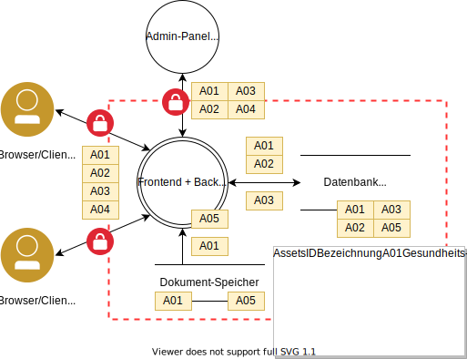

[](https://github.com/arne-kapell/patient-data-management/actions/workflows/deploy.yml)
[](https://github.com/arne-kapell/patient-data-management/actions/workflows/gitleaks.yml)
[](https://github.com/arne-kapell/patient-data-management/actions/workflows/codeql.yml)
# Patient Data Management System
Webanwendung zur Verwaltung von persönlichen, medizinischen Daten.

Features:
- Dokumentenverwaltung (Upload, Download, Löschen) inkl. In-Browser-Vorschau
- Zugriffs-Freigabe für Angehörige und Ärzte

## Deployment
---
Die Anwendung ist vollständig containerisiert und kann mit Docker und Docker Compose einfach aufgesetzt werden. Die benötigten Docker-Images werden automatisch von Docker Hub geladen bzw. gebaut.

### Testumgebung
```bash
docker-compose up
```
Die folgenden Services stehen zur Verfügung:
| Service                 | Port |
| ----------------------- | ---- |
| Django (Server + UI)    | 8000 |
| PostgreSQL              | -    |
| adminer (DB-Management) | 8080 |

### Produktivumgebung
```bash
docker-compose -f docker-compose.prod.yml up -d
```
Zusätzlich wird eine lokale traefik-Instanz (als reverse proxy) benötigt, die erforderlichen `labels` für das VPS-Deployment ([cloud.arne-kapell.de](https://cloud.arne-kapell.de)) sind bereits in der `docker-compose.prod.yml` hinterlegt.

*adminer* als leichtgewichtiges DB-Management-Tool wird in der Produktivumgebung nicht gestartet, dafür jedoch ein Backup-Service, der die PostgreSQL-Datenbank automatisch in regelmäßigen Abständen sichert.

## Architektur und Bedrohungsanalyse
---


## Präsentationen
---
0. [Anforderungen bzw. Aufgabenstellung](slides/Laborarbeit2022AufgabeSichereSysteme.pdf)
1. [Sicherheitsanforderungen & Bedrohungsanalyse](slides/abgabe01.html)