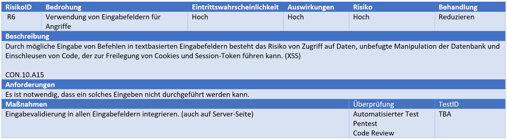
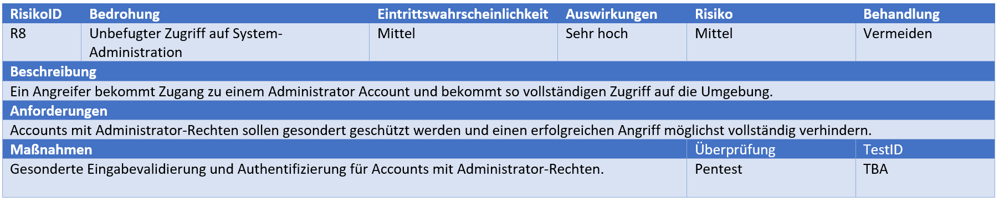
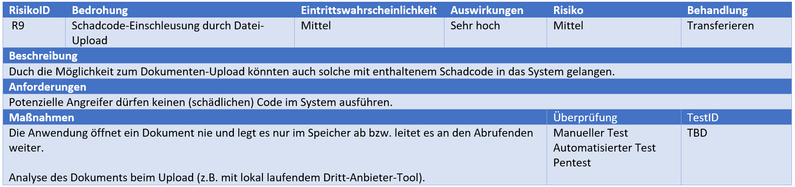

<!-- 
_paginate: false 
_class:
    - lead
-->
Projekt: Security by Design (Semester 5)

# Patient Data Management System

## Abschluss-Präsentation

*Irina Jörg, Finn Callies, Arne Kapell*

---
<!-- _paginate: false -->
# Threat Modeling

---
# Schutzziele

| Asset                      | Vertraulichkeit | Integrität | Verfügbarkeit |
| :------------------------- | :-------------: | :--------: | :-----------: |
| **A01**: Gesundheits-Daten |      X(1)       |    X(1)    |     X(2)      |
| **A02**: Persönl. Daten    |      X(1)       |    X(2)    |     X(3)      |
| **A03**: Anmelde-Daten     |      X(1)       |    X(2)    |     X(3)      |
| **A04**: Session-Daten     |      X(1)       |    X(3)    |     X(2)      |
| **A05**: Log-Daten         |      X(2)       |    X(1)    |     X(3)      |

---
# Technologie-Stack

- Django (Python) für Frontend und Backend
  - integriertes Admin-Interface
- Relationale Datenbank (PostgreSQL)
*vorher: SQLite*

---
<!-- _class: lead -->
# Risiko-Register
<!-- TODO -->

---
# Risiko-Register (1/4)

---
# Risiko-Register (2/4)

---
# Risiko-Register (3/4)

---
# Risiko-Register (4/4)

---
<!-- _class: lead -->
# Modulstruktur

---
TODO

---
<!-- _class: lead -->
# Werkzeuge
Entwicklungs-Tools

---
# Entwicklungs-Tools
- Git(Hub)
- Visual Studio Code
- Docker/Podman (+ Compose)
- Anaconda (Python Virtual Environment)

---
<!-- _class: lead -->
# CI/CD
Pipeline für Build, Test und Deployment

---
# Pipelines
- laufen auf GitHub Actions
- werden bei jedem Push aufgerufen

---
# Build
- Builden der eigenen Docker-Images (Django) auf dem Ziel-System
- verwenden von bereits vorhandenen Images (z.B. PostgreSQL) soweit möglich
- Nutzung von Caching für einzelne Build-Schritte durch Docker(-Compose)
---
# Tests und Checks
- Django-Tests in der Deployment-Pipeline
- CodeQL-Checks für statische Code-Analyse
- SonarQube-Checks für qualitative Code-Review
- GitLeaks als Secret-Scanner
---

# Deployment
0. Tests als Quality-Gate
1. Pushen des Source-Codes zum VPS Ziel-System
2. Deployment des Stacks mit Docker-Compose
3. Reverse-Proxy für HTTPS-Verbindungen (traefik)

---
<!-- _class: lead -->
# Demo
Projekt und Source-Code (Repository)
---
---
<!-- _class: lead -->
# Tests
Testplan und Ergebnisse

---
# Secure by Design
- Top 10 OWASP
- ...

---
<!-- 
_class: lead
paginate: false
-->
# Vielen Dank fürs Zuhören

Fragen?
