<!-- 
_paginate: false 
_class:
    - lead
-->
Projekt: Security by Design (Semester 5)

# Patient Data Management System

## Abschluss-Präsentation

*Irina Jörg, Finn Callies, Arne Kapell*

---
<!-- _paginate: false -->
# Threat Modeling

---
# Technologie-Stack

- Django (Python) für Frontend und Backend
  - integriertes Admin-Interface
- Relationale Datenbank (PostgreSQL)
*vorher: SQLite*

---
<!-- _class: lead
# Risiko-Register

--- -->
<!-- # Risiko-Register (1/4)

--- -->
<!-- _class: lead -->
# Modulstruktur

---

---
<!-- _class: lead -->
# Werkzeuge
Entwicklungs-Tools

---
# Entwicklungs-Tools
- Git(Hub)
- Visual Studio Code
- Docker/Podman (+ Compose)
- Anaconda (Python Virtual Environment)

---
<!-- _class: lead -->
# CI/CD
Pipeline für Build, Test und Deployment

---
# Pipelines
- laufen auf GitHub Actions
- werden bei jedem Push aufgerufen

---
# Build
- Builden der eigenen Docker-Images (Django) auf dem Ziel-System
- verwenden von bereits vorhandenen Images (z.B. PostgreSQL) soweit möglich
- Nutzung von Caching für einzelne Build-Schritte durch Docker(-Compose)
---
# Tests und Checks
- Django-Tests in der Deployment-Pipeline
- CodeQL-Checks für statische Code-Analyse
- SonarQube-Checks für qualitative Code-Review
- GitLeaks als Secret-Scanner
---

# Deployment
0. Tests als Quality-Gate
1. Pushen des Source-Codes zum VPS Ziel-System
2. Deployment des Stacks mit Docker-Compose
3. Reverse-Proxy für HTTPS-Verbindungen (traefik)

---
<!-- _class: lead -->
# Demo
Projekt und Source-Code (Repository)
---
---
<!-- _class: lead -->
# Tests
Testplan und Ergebnisse

---
# Funktionale Tests
| TestID | Typ     | Beschreibung                                         |
| -----: | ------- | ---------------------------------------------------- |
|    FT1 | Unit-T. | Benutzer-Erstellung und -Entfernung inklusive Rollen |
|    FT2 | Unit-T. | Intigrität des Rollensystems                         |
|    FT3 | Unit-T. | Login, Logout                                        |
|    FT4 | Unit-T. | Email-Verifikation                                   |
|    FT5 | Unit-T. | Erstellen und Entfernen von Zugriffsanfragen         |
|    FT6 | Unit-T. | Upload, Vorschau und entfernen von Dokumenten        |
---

# Security Tests (1/10)
| TestID | Typ                        | Beschreibung                                                                                                                                               | Schritte                                                                                                                       | Erwartetes Ergebnis                                                                    |       Status       |
| -----: | -------------------------- | ---------------------------------------------------------------------------------------------------------------------------------------------------------- | ------------------------------------------------------------------------------------------------------------------------------ | -------------------------------------------------------------------------------------- | :----------------: |
|     T1 | Unit-Tests                 | Gesundheits- bzw. persönliche Daten dürfen nur nach erfolgreicher Authentifizierung und nach autorisierung (mit den erforderlichen Rechten) abrufbar sein. | Versuchen, Daten ohne vorherigen Login bzw. mit unautorisiertem Benutzer abzurufen                                             | Blockieren mit Fehlermeldung ohne Daten-Leck                                           | :heavy_check_mark: |
---

# Security Tests (2/10)
| TestID | Typ                        | Beschreibung                                                                                                                                               | Schritte                                                                                                                       | Erwartetes Ergebnis                                                                    |       Status       |
| -----: | -------------------------- | ---------------------------------------------------------------------------------------------------------------------------------------------------------- | ------------------------------------------------------------------------------------------------------------------------------ | -------------------------------------------------------------------------------------- | :----------------: |
|     T2 | Unit-Tests                 | Persönliche Daten dürfen nur für den jeweiligen Nutzer einsichtbar sein.                                                                                   | Versuchen auf die persönlichen Daten eines anderen Benutzers zuzugreifen                                                       | Blockieren mit Fehlermeldung ohne Daten-Leck                                           | :heavy_check_mark: |
---

# Security Tests (3/10)
| TestID | Typ                        | Beschreibung                                                                                                                                               | Schritte                                                                                                                       | Erwartetes Ergebnis                                                                    |       Status       |
| -----: | -------------------------- | ---------------------------------------------------------------------------------------------------------------------------------------------------------- | ------------------------------------------------------------------------------------------------------------------------------ | -------------------------------------------------------------------------------------- | :----------------: |
|     T3 | Unit-Test / Manueller Test | Dokumente können nicht von Benutzern ohne erteilte Freigabe eingesehen werden                                                                              | Versuchen durch Umgehung der Freigabe-Bestimmung an Dokumente zu gelangen                                                      | Blockieren mit Fehlermeldung                                                           | :heavy_check_mark: |
---

# Security Tests (4/10)
| TestID | Typ                        | Beschreibung                                                                                                                                               | Schritte                                                                                                                       | Erwartetes Ergebnis                                                                    |       Status       |
| -----: | -------------------------- | ---------------------------------------------------------------------------------------------------------------------------------------------------------- | ------------------------------------------------------------------------------------------------------------------------------ | -------------------------------------------------------------------------------------- | :----------------: |
|     T4 | Transaktion-Test           | Daten können nicht durch Überwachung des Kommunikations-Kanals exfiltriert werden                                                                          | Abfangen der Datenübertragung mittels Netzwerkmonitoring Tools                                                                 | Alle abgefangenen Dateien/Informationen befinden sich in einem verschlüsselten Zustand | :heavy_check_mark: |
---

# Security Tests (5/10)
| TestID | Typ                        | Beschreibung                                                                                                                                               | Schritte                                                                                                                       | Erwartetes Ergebnis                                                                    |       Status       |
| -----: | -------------------------- | ---------------------------------------------------------------------------------------------------------------------------------------------------------- | ------------------------------------------------------------------------------------------------------------------------------ | -------------------------------------------------------------------------------------- | :----------------: |
|     T5 | Unit-Test und Pentests     | Zugriff auf Daten in der Datenbank durch SQL Abgfragen erlangen                                                                                            | Zugriff auf Datenbank mitells SQL Injection                                                                                    | Abblocken des Angriffs durch Eingabevalidierung                                        | :heavy_check_mark: |
---

# Security Tests (6/10)
| TestID | Typ                        | Beschreibung                                                                                                                                               | Schritte                                                                                                                       | Erwartetes Ergebnis                                                                    |       Status       |
| -----: | -------------------------- | ---------------------------------------------------------------------------------------------------------------------------------------------------------- | ------------------------------------------------------------------------------------------------------------------------------ | -------------------------------------------------------------------------------------- | :----------------: |
|     T6 | Manueller-Test             | Zugriff auf Daten in der Datenbank nur mit Autorisierung                                                                                                   | Verbindungsaufbau zur Datenbank ohne gültigen Benutzer bzw. Benutzer mit nötigen Berechtigungen und Versuch Zugang zu erlangen | Verhindern durch Berechtigungsprüfung                                                  | :heavy_check_mark: |
---

# Security Tests (7/10)
| TestID | Typ                        | Beschreibung                                                                                                                                               | Schritte                                                                                                                       | Erwartetes Ergebnis                                                                    |       Status       |
| -----: | -------------------------- | ---------------------------------------------------------------------------------------------------------------------------------------------------------- | ------------------------------------------------------------------------------------------------------------------------------ | -------------------------------------------------------------------------------------- | :----------------: |
|     T7 | Unit-Tests/Manuelle Tests  | Zugriff durch Ausnutzung typischer Web-Schwachstellen wie CSRF oder XSS nicht möglich                                                                      | Test-Eingaben, etc.                                                                                                            | Restriktives Verhalten der Anwendung ohne Daten preiszugeben                           | :heavy_check_mark: |
---

# Security Tests (8/10)
| TestID | Typ                        | Beschreibung                                                                                                                                               | Schritte                                                                                                                       | Erwartetes Ergebnis                                                                    |       Status       |
| -----: | -------------------------- | ---------------------------------------------------------------------------------------------------------------------------------------------------------- | ------------------------------------------------------------------------------------------------------------------------------ | -------------------------------------------------------------------------------------- | :----------------: |
|     T8 | Unit-Test  /DDOS           | Datenbank ist vor Ausfall geschützt                                                                                                                        | Durch erhöhte Anzahl an Anfragen Verbindung zur Datenbank kompromittieren                                                      | Ausfallzeit so gering wie möglich (optional auch restriktives Verhalten)               | :heavy_check_mark: |
---

# Security Tests (9/10)
| TestID | Typ                        | Beschreibung                                                                                                                                               | Schritte                                                                                                                       | Erwartetes Ergebnis                                                                    |       Status       |
| -----: | -------------------------- | ---------------------------------------------------------------------------------------------------------------------------------------------------------- | ------------------------------------------------------------------------------------------------------------------------------ | -------------------------------------------------------------------------------------- | :----------------: |
|     T9 | Unit-Test                  | Administrator Oberfläche nur für Administratoren sichtbar                                                                                                  | Versuchen an Informationen zu gelangen, die nur für Administratoren gedacht sind                                               | Fehlermeldung wegen fehlenden Berechtigungen für den Zugriff                           | :heavy_check_mark: |
---

# Security Tests (10/10)
| TestID | Typ                        | Beschreibung                                                                                                                                               | Schritte                                                                                                                       | Erwartetes Ergebnis                                                                    |       Status       |
| -----: | -------------------------- | ---------------------------------------------------------------------------------------------------------------------------------------------------------- | ------------------------------------------------------------------------------------------------------------------------------ | -------------------------------------------------------------------------------------- | :----------------: |
|    T10 | Unit-Test                  | Anwendung ist vor Infizierungen durch Dateien geschützt                                                                                                    | Infizierte Datei unter Dokumenten hochladen                                                                                    | Filtern der Datei durch Clam AV                                                        |        :x:         |
---
# Secure by Design
- Dokumenten-Zugriff-Anfragen zeitlich begrenzt (max. 1 Jahr)
- Zugriffs-Anfragen können abgelehnt und vom Steller zurückgezogen werden
- Dokumente können nur vom Eigentümer und einem Arzt überschrieben werden
- Löschen eines Benutzers löscht auch alle Dokumente und Zugriffs-Anfragen (Cascade)
- Datenbank-Backup (automatisch)

---
<!-- 
_class: lead
paginate: false
-->
# Vielen Dank fürs Zuhören

Fragen?
